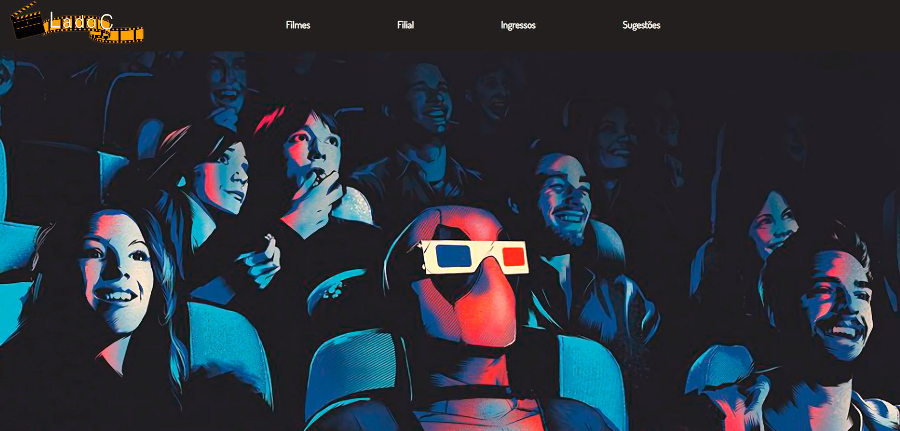

# Terceiro projeto em grupo - Lado C
O objetivo do projeto é abrigar um website de cinema que trará informações das filiais e dos filmes em cartaz, além disso, também contendo uma seção de sugestões onde será de total domínio dos clientes para expor suas ideias e ajudar nas melhorias do cinema.

A página principal do site está reponsiva, porém ainda há alguns detalhes que preciso ajeitar e já estou trabalhando nisso. Foram feitas algumas adaptações para a execução em desktop, e não em mobile, apesar de ser uma parte importante do website. Foi necessário a entrega do trabalho e pelo tempo corrido, optei por deixar mais funcional e abrir mão da responsividade e estilo da página. Está tudo funcional, porém estarei desfazendo as adaptações e revisando todo o código para deixá-lo mais claro e responsivo.

A webpage pode ser acessada por esse link: https://ladoc.onrender.com

A API pode ser acessada por este link: https://github.com/XandyNinfadora/Projeto_Squad_M5

<h3> Como rodar o projeto:</h3>
<h4> Você pode clonar o projeto e rodá-lo localmente seguindo os passos a seguir</h4>
<ol>
<li> Comece com o git clone no link https://github.com/XandyNinfadora/M3-Cinema para a clonagem do mesmo </li>
<li> No terminal, npm install para a instalação das dependências do projeto </li>
<li> npm run dev para iniciar o projeto no servidor local </li>
<li> Acessar http://localhost:5173 em seu navegador </li>
<li> Caso ocorra de não estar nessa porta, observe a mensagem no terminal que dirá em qual está </li>
</ol>

## Métodos
Podem ser utilizados os seguintes métodos na rota /sugestões
<ol>
<li> GET </li>
<li> PUT </li>
<li> POST </li>
<li> DELETE </li>
</ol>

## Endpoints
<ol>
<li> /filmes </li>
<li> /filial </li>
<li> /ingressos </li>
<li> /sugestoes </li>
</ol>

## Dependências utilizadas
- Axios;
- Framer Motion;
- React;
- React DOM; 
- React Router DOM;
- React Icons.

## Integrantes

[Andrielle Pessanha] (https://github.com/XandyNinfadora)

[Jonas Santana] (https://github.com/sunsetmonk)

[Tássio Rodrigues] (https://github.com/tassiofeliperj)

[Marcelo Younes] (https://github.com/marceloydm)

[Gabriel Conceição] (https://github.com/BieldoJT)

 
